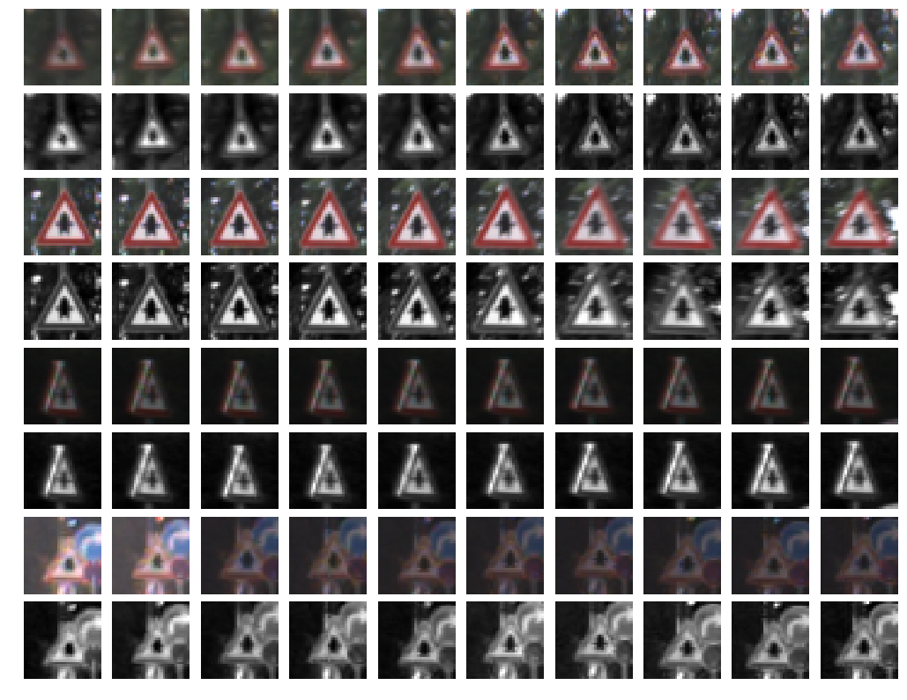
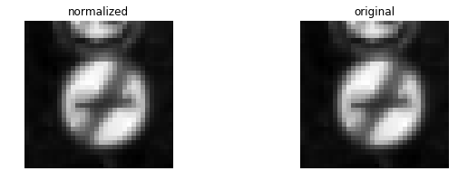
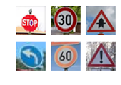
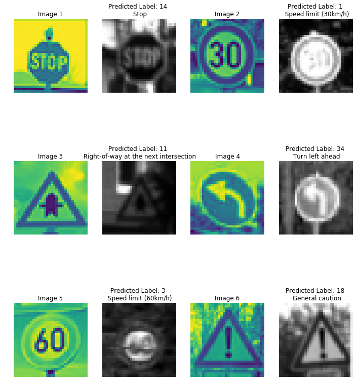

# **Traffic Sign Recognition** 

### The code for this project can be found in this [Jupyter Notebook.](./Traffic_Sign_Classifier.ipynb)

### **Build a Traffic Sign Recognition Project**

The goals/steps of this project are the following:

* Load the data set (see below for links to the project data set)
* Explore, summarize and visualize the data set
* Design, train and test a model architecture
* Use the model to make predictions on new images
* Analyze the softmax probabilities of the new images
* Summarize the results with a written report

### Data Set Summary & Exploration

#### 1. Provide a basic summary of the data set. In the code, the analysis should be done using python, numpy, and/or pandas methods rather than hardcoding results manually.

I used the NumPy library to calculate summary statistics of the traffic
signs data set

* The size of training set is <b>`34799`</b>
* The size of the validation set is <b>`4410`</b>
* The size of test set is <b>`12630`</b>
* The shape of a traffic sign image is <b>`(32, 32, 3)` # 3 becuase of R,G,B Channels.</b>
* The number of unique classes/labels in the data set is <b>`43`</b>

#### 2. Include an exploratory visualization of the dataset.

Here is an exploratory visualization of the data set. It is a bar chart showing how the data is distributed alongside our 43 unique label points.

As we can see labels marked as `Speed limit(30km/h)`, `Speed limit(50km/h)`, `Speed limit(70km/h)` & `Speed limit(80km/h)`, along with `No Passing for vehicles over 3.5 metric tones`,`Priority work`,`Yeild`, `Road Work`, `Keep right` are among the top labels with majority of samples. Whereas, certain labels like `Speed limit(20km/h)`, `Dangerous Curve to the left`, `Pedestrians` and `Go Straight or left` are among the few labels with least amount of samples.

### Design and Test a Model Architecture

#### 1. Describe how you preprocessed the image data. What techniques were chosen, and why did you choose these techniques? Consider including images showing the output of each preprocessing technique. Pre-processing refers to techniques such as converting to grayscale, normalization, etc.

To preprocess the data, the following steps were taken on all train, validation, and test set.

* <b>Converting to grayscale</b> - This worked well for both authors Sermanet and LeCun as described in their [Traffic Sign Classification Article](http://yann.lecun.com/exdb/publis/pdf/sermanet-ijcnn-11.pdf). For our pipeline, it also helped reduce training time by a lot as the color channels were dropped from 3 to 1. 

* <b>Normalizing the data to the range (-1,1)</b> - This was done using the line of code `(dataset - 128)/128`. The resulting dataset mean wasn't exactly `zero`, but it was reduced from being around `82.677589037` to roughly around `-0.354081335648`. This helps during training time as it reduces the possibility of having a wider distribution in the data which would have made it more difficult and to train using a singular learning rate.

#### 2. Describe what your final model architecture looks like including model type, layers, layer sizes, connectivity, etc.) Consider including a diagram and/or table describing the final model.

For this LeNet CNN implementation, I modified the final model based on the following [paper](http://yann.lecun.com/exdb/publis/pdf/sermanet-ijcnn-11.pdf) by Prof. Yann LeCun.
This paper outlines a modified LeNet design specifically for Trafic Sign Classification problems. This modified architecture takes and input of gray scaled images and consists of the following layers:

##### Input

This LeNet architecture accepts a 32x32xC image as input, where C is the number of color channels. For our case after preprocessing, initially C would have been 3 due to three layers of RGB Color channel but now as images are in left gray color channel, therefore C = 1.

##### Activation Function used:

- ReLU

##### Number of Epochs and Batch Size after Experimentation.
| Value                 |     Type         | 
|:---------------------:|:---------------------------------------------:| 
| 60 | EPOCH | 
| 100 | BATCH |

##### Architecture

| Layer                 |     Description         | 
|:---------------------:|:---------------------------------------------:| 
| Input                 | 32x32x1 Gray Scale image (preprocessed)  | 
| Layer 1 - Convolution 5x5   | [1,2,2,1] stride, valid padding, output shape 28x28x6 |
| RELU                    | Activation Method |
| Max pooling              | 2x2 stride,  outputs 14x14x6 (refered as subsampling in the paper) |
| Layer 2 - Convolution 5x5   | [1,2,2,1] stride, valid padding, output shape 10x10x16 |
| ReLU    | Activation Method |
| Max pooling              | 2x2 stride,  outputs 5x5x16 (refered as subsampling in the paper) |
| Layer 3 - Convolution 5x5   | [1,2,2,1] stride, valid padding, output shape 1x1x400 |
| ReLU    | Activation Method |
|Flatten & Merge| Flatten the output shape of the `Layer 2 Max Pooling` and `Layer 3 Convlution` output of 1x800. The easiest way to do is by using `tf.contrib.layers.flatten.`|
|Layer 4 - Fully Connected | This will have 800 outputs|
|Dropout | Here we drop and kep probabilities |
|Layer 5 - Fully Connected (Logits) | This should result in 43 outputs as there are 43 total classes. |

##### Output (Logits)

- Returns the result of the 2nd fully connected layer i.e. 43 logits.
 

#### 3. Describe how you trained your model. The discussion can include the type of optimizer, the batch size, number of epochs, and any hyperparameters such as learning rate.

To train the model, I first ran on just the normalized dataset which achieved an accuracy of 92.7% on validation. This accuracy was fine but still wasn't enough for creating a robust classifier. On running the same model on the default architecture i.e, `batch size: 128`, `epochs: 10`, `rate: 0.001`, `mu: 0`, `sigma: 0.1` but this time with grayscaled and normalized inputs as described in the LeNet lab.  I achieved an approx. 94.3% accuracy on validation; this was a big improvement. But later when I started playing with the actual model and got onto the tuning the rate, epoch and batch size, in hopes of gaining a better model, I came to a realization, that the model was just improving slightly (and in some cases acting really worse) when it was either tuned too much on just these variable or the batch size was increased more than 128 units. On researching a lot about actual LeNet structure on Prof. Yann LeCun's Site, I came across an article on using LeNet architecture for traffic signs. This article was old but was robust enough to classify traffic signs with a 99% accuracy. 

So I decided to go ahead and modify the current architecture with the defined architecture in the paper. Some things, which I did not change during implementation were the optimizer which was `Adam optimizer`, already implemented in the LeNet lab and mu, sigma values which are `0` and `0.1` respectively. The rest of the Hyperparameters were modified over a few tests, and the following settings were used:

- batch size: `100`
- epochs: `60`
- learning rate: `0.0009`
- dropout keep probability: `0.5`

#### 4. Describe the approach taken for finding a solution and getting the validation set accuracy to be at least 0.93. Include in the discussion the results on the training, validation and test sets and wherein the code these were calculated. Your approach may have been an iterative process, in which case, outline the steps you took to get to the final solution and why you chose those steps. Perhaps your solution involved an already well-known implementation or architecture. In this case, discuss why you think architecture is suitable for the current problem.

My final model results after training were:

* validation set accuracy of `96.5`
* test set accuracy of `94.2`

My approach was a little of both. As I mentioned earlier, I started with pre-defined architecture (LeNet Model as provided in the previous lab) and with almost all of the tweaking and modifications, there was an iterative process of trial and error involved to a certain extent. After various hours and days spent, to just tune the hyperparameters against training to get a good level of validation accuracy, it was not soon after I discovered that this trial and error method to only tune model's parameters is nothing but an elaborated double-sided inequality for each hyperparameter, and hence it will take a long time to identify bounds and then tune further to minimize gap, i.e., a losing strategy when it comes to building the neural nets. So I researched online on provided sources and found a reference to modified LeNet Architecture on Prof. Yann LeCun's Website, this model was a perfect fit for this exercise as it was not only specific to traffic signs classification itself, but it also highlighted a well defined preprocessing strategy for input dataset and outlined various steps in improving model architecture to increase validation accuracy.

### Test a Model on New Images

#### 1. Choose five German traffic signs found on the web and provide them in the report. For each image, discuss what quality or qualities might be difficult to classify.

Here are five German traffic signs that I found on the web, I manually scaled each of them via Mac Preview to shape(32,32,3), but I tend to automate this process by creating a resize function for input images, so it does it by default.

- Input Image shape: <b>`(32, 32, 3)`</b>

- After Processing Image the list shape is: <b>`(6, 32, 32, 1)`</b>

#### 2. Discuss the model's predictions on these new traffic signs and compare the results to predicting on the test set. At a minimum, discuss what the predictions were, the accuracy of these new predictions, and compare the accuracy to the accuracy on the test set.

Here are the results of the prediction:

The model was able to correctly guess `6 of 6 traffic signs`, which gives an accuracy of `100%`. This compares slightly favorably to the accuracy on the test set of `94.2 %`, but I still believe if given an input of one of the smaller sampled games the classifier will probably tend to fail. Here Dataset Augmentation may help.

#### 3. Describe how certain the model is when predicting on each of the five new images by looking at the softmax probabilities for each prediction. Provide the top 5 softmax probabilities for each image along with the sign type of each probability.

Here are the Top 5 Softmax Probabilities of predicted labels by our model for each input image.

File Name : ['./test_images/image6.png'](./test_images/image6.png)

| Label |  Softmax Probabilities |
|:--------:|:-----------:|
| Stop | 0.06078015 |
| No entry | 0.02236400 |
| No passing | 0.02236312 |
| Speed limit (120km/h) | 0.02236238 |
| Speed limit (20km/h) | 0.02236232 |

File Name : ['./test_images/image2.png'](./test_images/image2.png)

| Label |  Softmax Probabilities |
|:--------:|:-----------:|
|Speed limit (30km/h) | 0.06078682 |
|Speed limit (20km/h) | 0.02236222 |
|Speed limit (50km/h) | 0.02236222 | 
|Speed limit (60km/h) | 0.02236222 |
|Speed limit (70km/h) | 0.02236222 |

File Name : ['./test_images/image1.png'](./test_images/image1.png)

| Label |  Softmax Probabilities |
|:--------:|:-----------:|
|Right-of-way at the next intersection| 0.06078682|
|Speed limit (20km/h)| 0.02236222|
|Speed limit (30km/h)| 0.02236222|
|Speed limit (50km/h)| 0.02236222|
|Speed limit (60km/h)| 0.02236222|

File Name : ['./test_images/image4.png'](./test_images/image4.png)

| Label |  Softmax Probabilities |
|:--------:|:-----------:|
Turn left ahead | 0.06078682
Speed limit (20km/h)| 0.02236222
Speed limit (30km/h)| 0.02236222
Speed limit (50km/h)| 0.02236222
Speed limit (60km/h)| 0.02236222

File Name : ['./test_images/image3.png'](./test_images/image3.png)

| Label |  Softmax Probabilities |
|:--------:|:-----------:|
Speed limit (60km/h)| 0.06078448
Speed limit (50km/h)| 0.02236315
Speed limit (20km/h)| 0.02236225
Speed limit (30km/h)| 0.02236225
Speed limit (70km/h)| 0.02236225

File Name : ['./test_images/image5.png'](./test_images/image5.png)

| Label |  Softmax Probabilities |
|:--------:|:-----------:|
|General caution| 0.06078682|
|Speed limit (20km/h)| 0.02236222|
|Speed limit (30km/h)| 0.02236222|
|Speed limit (50km/h)| 0.02236222|
|Speed limit (60km/h)| 0.02236222|

The model seems to be `.06078 %` sure about the predicted labels. Well this, as we can see, is still not the most robust model. I believe that this can be tested to improve by incorporating more features in the dataset preprocessing like brightness adjustments, data augmentation, image resizing, and stabilizing.